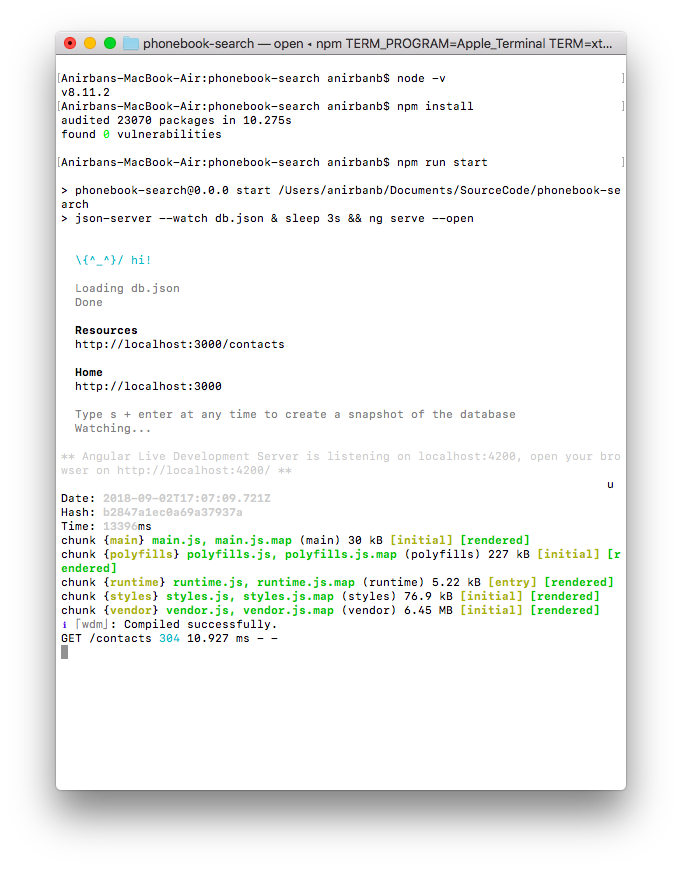
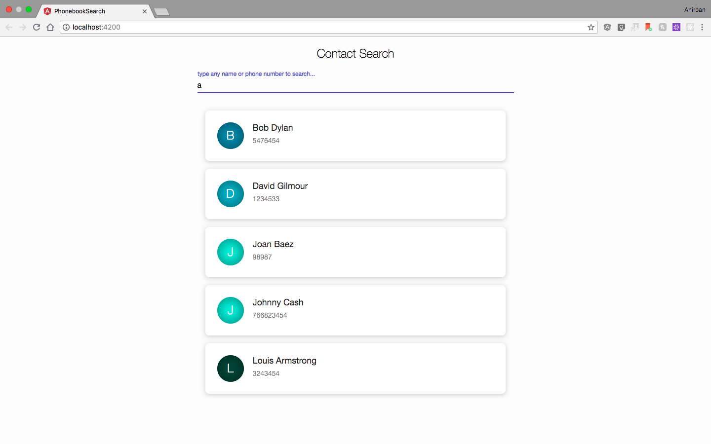

# Phonebook Search
A simple phonebook app built with Angular where users can search the contacts fetched from API.

This project is generated with [Angular CLI](https://github.com/angular/angular-cli) version 6.0.3.

## Assumptions & Development

* I am using [json sever](https://github.com/typicode/json-server) to make make RESTful endpoints, contacts detail are sored in `db.json` in the root.
* In order to run the application, port `3000` and port `4200`  should not be used by any other application.
* By default the contact will appear sorted by name fashion.
* The application can handle a contact without any name. To demonstrate that a contact with blank name has been created and its intentional.
* The colors in the avatar are randomly genereted and signifies the initial letter of the name.
* Only tested in `Chrome` and `Firefox` (Recent Versions).

## Prerequisites & Setup

* You need to have [Node](https://nodejs.org) installed in your system.

## Run

* Open command line (Windows) or terminal (Mac) Navigate to the root directory of the project ~

* Run the following to install all dependencies (Need to do it only once)

```command line
npm install
```
* Run the following to serve the application. it will open the application in the following url `http://localhost:4200/`

```command line
npm run start
```
* If by any chance the previous command does not run the application, you can run the following two commands sequentially and seperately to run the apllication.

```command line
json-server --watch db.json
ng serve --open
```
* Example Run



## Running unit tests

Run `ng test` to execute the unit tests via [Karma](https://karma-runner.github.io).

## Areas of improvement

* Error Handling
* Unit tests
* Animation

## Thank You